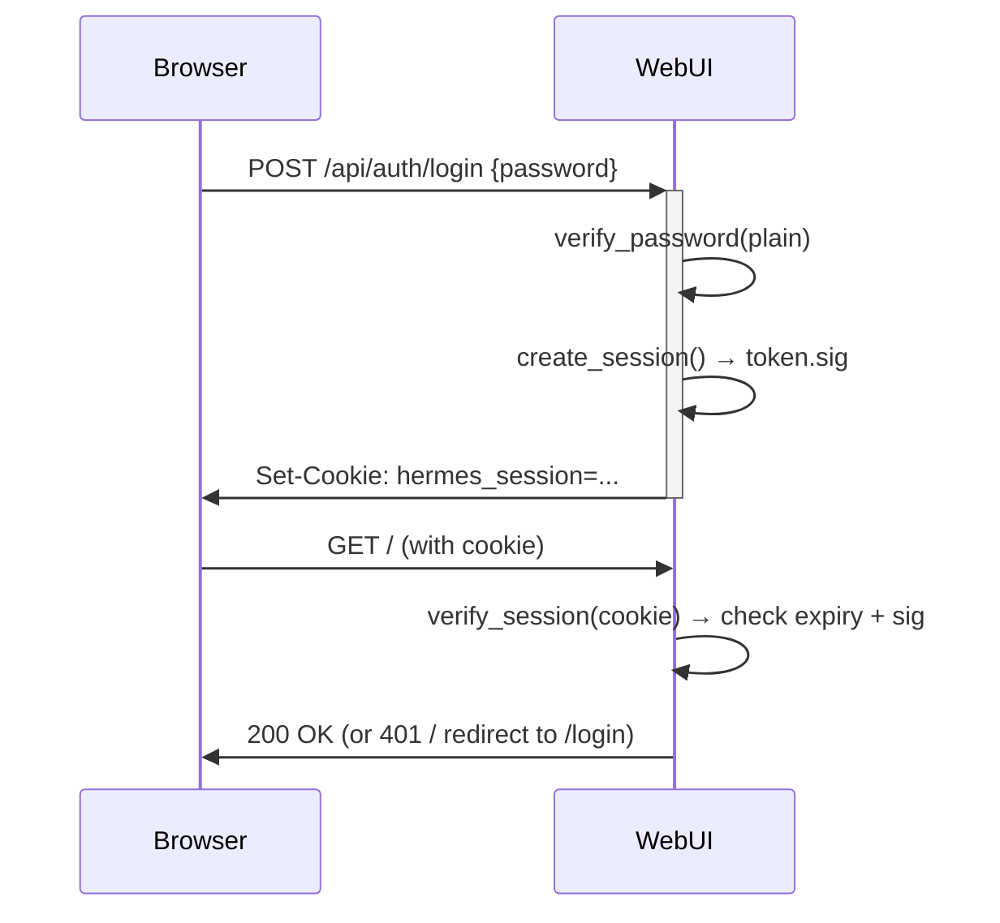

# Hermes WebUI — Auth & Profile Isolation Architecture

## Overview

Hermes WebUI (`hermes-webui/`, a separate repo from hermes-agent) provides a browser-based chat interface. It has two independent concerns that together govern multi-user isolation:

1. **Auth** (`api/auth.py`) — session cookies, password verification
2. **Profiles** (`api/profiles.py`) — Hermes `HERMES_HOME` isolation, per-request TLS context

These two systems currently operate **independently**: auth verifies a password and issues a session cookie; profiles switch via a separate `hermes_profile` cookie set by the UI. They are NOT tied together by default.

## Auth System (`api/auth.py`)

### Two Auth Modes

The WebUI has two mutually-exclusive auth modes. Both use the same PBKDF2-SHA256 hashing (600k iterations, salt = persisted random signing key) and same session cookie format:

| Mode | Trigger | Login flow | Username? |
|------|---------|------------|-----------|
| **Single-password** | `HERMES_WEBUI_PASSWORD` env var or `settings.json` → `password_hash` | Type password on login page | No |
| **Multi-user** | `~/.hermes/webui/users.json` has ≥1 entry | Type username + password | Yes |

**Priority:** `HERMES_WEBUI_PASSWORD` env var > settings.json `password_hash` > multi-user mode (`users.json`). If the env var is set, multi-user mode is effectively disabled.

**`is_auth_enabled()` returns True if EITHER** a password hash is available **OR** `list_users()` returns ≥1 entry. So even without the env var, a single entry in `users.json` locks the WebUI behind a login screen.

### Detecting Which Mode Is Active

```bash
# Check if HERMES_WEBUI_PASSWORD is set in the running process:
cat /proc/$(pgrep -f "server\.py" | head -1)/environ 2>/dev/null | tr '\0' '\n' | grep HERMES_WEBUI_PASSWORD

# Check if any multi-user accounts exist:
cat ~/.hermes/webui/users.json 2>/dev/null

# Check settings.json for password_hash:
python3 -c "import json; d=json.load(open('$HOME/.hermes/webui/settings.json')); print('password_hash:', d.get('password_hash'))"
```

### Single-Password Mode

- One global password, set via `HERMES_WEBUI_PASSWORD` env var or settings.json `password_hash`
- Login page shows only a password field (no username)
- Session token: `secrets.token_hex(32)`, persisted in `STATE_DIR/.sessions.json`
- Session TTL: 30 days default (env `HERMES_WEBUI_SESSION_TTL` or settings override)
- Session cookie: `hermes_session` (HttpOnly, SameSite=Lax, path=/)

### Login Flow



### PUBLIC_PATHS (no auth required)

```
/login, /health, /favicon.ico, /sw.js,
/api/auth/login, /api/auth/status,
/manifest.json, /manifest.webmanifest,
/static/*, /session/static/*
```

### Auth State Endpoints

- `GET /api/auth/status` → `{auth_enabled: bool, logged_in: bool}` (public)
- `POST /api/auth/login` → `{ok: true}` or `{error: str, ok: false}`
- `POST /api/auth/logout` → invalidates session, clears cookie

### Rate Limiting

- 5 attempts / 60s window per IP
- Persisted in `STATE_DIR/.login_attempts.json`

## Profile System (`api/profiles.py`)

### How Profiles Work

Each Hermes profile gets its own `HERMES_HOME`:

| Profile | Path |
|---------|------|
| default (root) | `~/.hermes/` |
| named profile | `~/.hermes/profiles/<name>/` |

Isolated per profile:
```
.cenv, config.yaml, SOUL.md
sessions/
skills/
memories/
logs/
plans/
workspace/
cron/ (jobs.json, output/)
skins/
```

### Thread-Local Request Isolation (#798)

Every HTTP request gets per-request TLS profile context:

```
server.py: do_GET() / do_POST()
  ├── cookie_profile = get_profile_cookie(handler)  # reads hermes_profile cookie
  ├── set_request_profile(cookie_profile)             # sets _tls.profile
  ├── handle_get(self, parsed)                        # routes.py reads TLS
  └── clear_request_profile()                         # finally block
```

`get_active_profile_name()` resolution order:
1. Thread-local (from `hermes_profile` cookie) — per-request
2. Process-level `_active_profile` — process startup default

### Profile vs Auth — The Gap

| | Auth (hermes_session) | Profile (hermes_profile) |
|---|---|---|
| **What** | Proves user knows the password | Selects which Hermes home to use |
| **How set** | Login page → Set-Cookie | UI settings → Set-Cookie |
| **Tied to user?** | No (single password, no user concept) | No (set by UI, not by login) |
| **Isolation** | Prevents unauthorized access | Isolates sessions/skills/config |

## Multi-User Mode (Already Implemented)

Multi-user auth is **already implemented and operational**. Activated whenever `~/.hermes/webui/users.json` contains at least one user entry.

### User Storage (`api/users.py`)

```json
// ~/.hermes/webui/users.json (0600 permissions)
{
  "123456789": {                    // username (typically Telegram Chat ID)
    "password_hash": "<pbkdf2-hex>",
    "profile": "tg_123456789",      // Hermes profile to route to
    "created_at": "2026-05-13T14:15:28Z"
  }
}
```

### Login Flow (Multi-User)

1. Login page shows **both** username and password fields
2. `POST /api/auth/login {username, password}` calls `verify_user_login(username, password)`
3. `verify_user_login()` looks up user in `users.json`, verifies PBKDF2 hash
4. On success: session cookie is created (same format as single-password mode)
5. Profile isolation: currently NOT auto-tied to login — the `hermes_profile` cookie is set independently by the UI

### User Management

Use `scripts/manage_users.py` from the `hermes-webui` repo root:

```bash
cd ~/hermes-webui

# List all users
python3 scripts/manage_users.py list

# Add user (username = Telegram Chat ID, password = login password)
python3 scripts/manage_users.py add <username> <password>

# Add user with specific profile mapping
python3 scripts/manage_users.py add <username> <password> --profile dev

# One-step: create user + Hermes profile
python3 scripts/manage_users.py init <username> <password> --profile dev

# Remove user
python3 scripts/manage_users.py remove <username>
```

**Password is hashed (PBKDF2-SHA256, 600k iterations, salt = signing key) — cannot be recovered.** Reset password by removing and re-adding the user.

### 🐛 Bug: `manage_users.py list` Fails (KeyError)

The `manage_users.py list` command crashes with `KeyError: 'username'` because `list_users()` returns dicts with key `user_id`, but the script accesses `u['username']`.

**Workarounds:**
```bash
# Option A — read users.json directly (quick check)
cat ~/.hermes/webui/users.json

# Option B — call list_users() from Python
python3 -c "from api.users import list_users; import json; print(json.dumps(list_users(), indent=2))"
```

The `remove` command works fine (only needs the username string).

### Adding Users by Python (Bulk / Multiple at Once)

When the `--profile` flag is needed or adding multiple users, skip the script and call the API directly:

```bash
cd ~/hermes-webui
python3 -c "
from api.users import add_user
r1 = add_user('826307909', 'Test2222', profile='tg_826307909')
print('OK:', r1['user_id'], '->', r1['profile'])
r2 = add_user('1596476147', '1596476147', profile='tg_1596476147')
print('OK:', r2['user_id'], '->', r2['profile'])
"
```

### Verifying Login via API

After adding/resetting users, verify credentials immediately:

```bash
# Correct password → {"ok": true, "profile": "tg_826307909"}
curl -s -X POST http://127.0.0.1:8787/api/auth/login \
  -H "Content-Type: application/json" \
  -d '{"username":"826307909","password":"Test2222"}'

# Wrong password → {"ok": false, "error": "Invalid credentials"}
curl -s -X POST http://127.0.0.1:8787/api/auth/login \
  -H "Content-Type: application/json" \
  -d '{"username":"826307909","password":"wrongpass"}'
```

### Password Recovery / Diagnosis

Since passwords are one-way hashed, if the password is lost:

```bash
# 1. Check which auth mode is active
python3 -c "
from api.auth import is_auth_enabled, get_password_hash
print('Auth enabled:', is_auth_enabled())
print('Has password hash:', get_password_hash() is not None)
from api.users import list_users
print('Users:', len(list_users()))
"

# 2. Check if HERMES_WEBUI_PASSWORD is set in the running process
cat /proc/$(pgrep -f "server\\.py" | head -1)/environ 2>/dev/null | tr '\0' '\n' | grep HERMES_WEBUI_PASSWORD || echo "not set in process env"

# 3. Reset password (remove + re-add)
cd ~/hermes-webui
python3 scripts/manage_users.py remove <username>

# 4. Add back using Python directly (see ⚠️ below)
python3 -c "from api.users import add_user; add_user('$USERNAME', '$NEW_PASSWORD', profile='tg_$USERNAME')"

# 5. Verify the new password works
curl -s -X POST http://127.0.0.1:8787/api/auth/login \
  -H "Content-Type: application/json" \
  -d '{"username":"$USERNAME","password":"$NEW_PASSWORD"}'
```

### ⚠️ Bug: `manage_users.py add --profile` Fails

The script's `add` subcommand passes `--profile` as a **positional** third argument to `add_user()`, but `add_user()` has the signature:

```python
def add_user(user_id, password, *, profile=None, ...)
```

The `*` makes `profile` keyword-only. So this **fails**:

```bash
# ❌ TypeError: add_user() takes 2 positional arguments but 3 were given
python3 scripts/manage_users.py add 123456789 Test2222 --profile tg_123456789
```

**Workaround:** Call `add_user()` directly:

```bash
python3 -c "from api.users import add_user; add_user('123456789', 'Test2222', profile='tg_123456789')"
```

Or if you don't need a custom profile (auto-derived from username):

```bash
python3 scripts/manage_users.py add 123456789 Test2222    # works without --profile
```

### The Remaining Gap: Login ↔ Profile Binding

A known gap remains: login authentication and profile selection are still decoupled. The `hermes_session` cookie authenticates the user, but the `hermes_profile` cookie (which routes to a specific Hermes profile for session/skill/memory isolation) is set by the UI independently. So:

- Two users logging in on the same browser would share the same browser-set profile cookie
- A user logging in as `admin` gets admin auth but could still be operating on the `dev` Hermes profile
- Full isolation would require setting BOTH cookies at login time, binding the session token to a (username, profile) tuple

## Key Files

| File | Purpose |
|------|---------|
| `api/auth.py` | Session mgmt, password hashing, cookie parsing |
| `api/profiles.py` | Profile state, TLS context, cron isolation |
| `api/routes.py` | ALL route handlers (9772 lines) — session list, profiles, login/logout |
| `server.py` | Thin routing shell, per-request TLS setup |
| `static/login.js` | Login form handler |
| `static/index.html` | Main app (no login UI, uses `/login` redirect) |
| `static/boot.js` | App bootstrap, checks `/api/auth/status` |

## Profile Cookie Utility Functions

In `server.py` — look for `get_profile_cookie()` and `set_profile_cookie()`:

```python
# Reading profile cookie
def get_profile_cookie(handler) -> str | None:
    cookie = parse_cookie(handler)
    return cookie  # This reads 'hermes_profile' cookie value

# Used at start of every request in do_GET/do_POST try block:
cookie_profile = get_profile_cookie(self)
if cookie_profile:
    set_request_profile(cookie_profile)
# ... route handling ...
# In finally block:
clear_request_profile()
```

The `hermes-profile` cookie key is a separate constant defined alongside `COOKIE_NAME` in `api/auth.py` — different from the `hermes_session` auth cookie.
